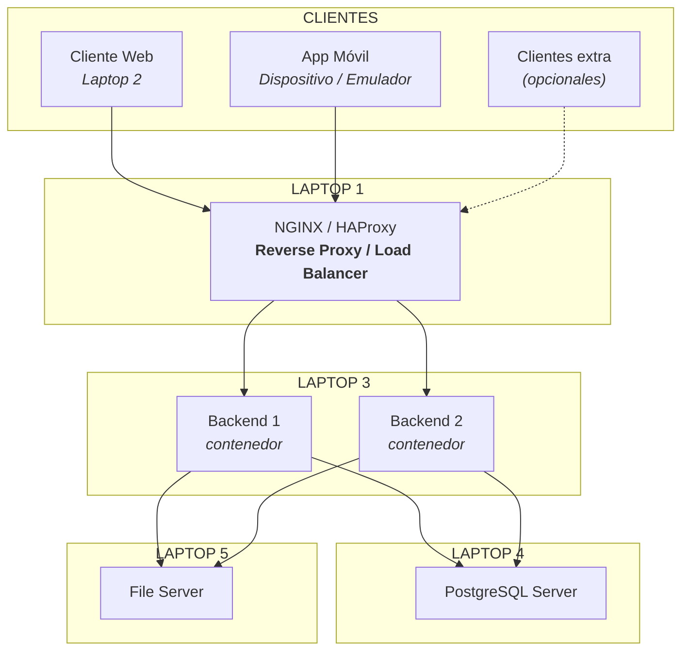

# Universidad Laica Eloy Alfaro de Manabí
## Proyecto Integrador Final
**IS-803 - Integración e Implementación de Software | Periodo 2026-2**

| Parámetro | Detalle |
| :--- | :--- |
| **Docente** | Ing. Junior José Zamora Mendoza, Mg. |
| **Integrantes** | Máximo 5 estudiantes por equipo |
| **Presentación final** | Semana 16 |
| **Modalidad** | Proyecto integrador distribuido + evaluación final |

---

## Contenido

1. [Propósito del proyecto](#1-propósito-del-proyecto)
2. [Distribución mínima de los cinco nodos](#2-distribución-mínima-de-los-cinco-nodos)
3. [Clientes obligatorios y clientes adicionales](#3-clientes-obligatorios-y-clientes-adicionales)
4. [Requisitos técnicos mínimos](#4-requisitos-técnicos-mínimos)
5. [Revisiones de avance](#5-revisiones-de-avance)
6. [Prueba de integración y fallo durante la defensa](#6-prueba-de-integración-y-fallo-durante-la-defensa)
7. [Documentación obligatoria](#7-documentación-obligatoria)
8. [Presentación final - Semana 16](#8-presentación-final---semana-16)
9. [Valor agregado y posible exoneración](#9-valor-agregado-y-posible-exoneración)
10. [Criterios generales de evaluación](#10-criterios-generales-de-evaluación)
11. [Consideración final](#11-consideración-final)

---

### 1. Propósito del proyecto

Cada equipo deberá identificar una **necesidad real** en un negocio, institución, emprendimiento, comunidad, actividad profesional u otro contexto concreto. El proyecto no debe ser una propuesta aislada de programación. Antes de definir tecnologías, el equipo deberá comprender el problema, identificar a sus usuarios y justificar por qué una solución integrada puede mejorar el proceso.

La meta del semestre será construir una **solución distribuida** que pueda demostrarse funcionando sobre varias computadoras conectadas en red. El usuario final deberá percibirla como un solo sistema, aunque internamente esté compuesta por diferentes servidores, clientes y servicios.

#### Arquitectura mínima del proyecto

Todos los equipos trabajarán sobre una **arquitectura física distribuida**. Las cinco laptops del grupo deberán conectarse a un switch y funcionar como nodos diferentes de una misma solución.



```text
                        CLIENTES
             ┌──────────────┬──────────────┐
             │              │              │
             ▼              ▼              ▼
       Cliente Web      App Móvil     Clientes extra
                                       (opcionales)
             │              │              │
             └──────────────┴──────────────┘
                            │
                            ▼
                 ┌────────────────────┐
                 │      LAPTOP 1      │
                 │  NGINX / HAProxy   │
                 │ Reverse Proxy /    │
                 │ Load Balancer      │
                 └─────────┬──────────┘
                           │
                     ┌─────┴─────┐
                     ▼           ▼
                Backend 1    Backend 2
                contenedor   contenedor
                     │           │
                     └─────┬─────┘
                           │
             ┌─────────────┴─────────────┐
             ▼                           ▼
        LAPTOP 4                    LAPTOP 5
       PostgreSQL                  File Server

        LAPTOP 2: Servidor del Frontend Web
        LAPTOP 3: Backend + instancias/contenedores
```

---

### 2. Distribución mínima de los cinco nodos

| Nodo | Responsabilidad principal | Funciones mínimas |
| :--- | :--- | :--- |
| **Laptop 1** | Punto de entrada | NGINX o HAProxy como Reverse Proxy y Load Balancer; recibe solicitudes y las distribuye al backend. |
| **Laptop 2** | Servidor del Frontend Web | Publica la aplicación web y se integra con el mismo ecosistema de servicios. |
| **Laptop 3** | Servidor Backend | Ejecuta como mínimo dos instancias o contenedores del backend para demostrar balanceo y tolerancia a la caída de una instancia. |
| **Laptop 4** | Servidor de Base de Datos | PostgreSQL u otro SGBD aprobado; concentra la persistencia principal del sistema. |
| **Laptop 5** | Servidor de Archivos | Almacena archivos, imágenes, documentos u otros recursos no convenientes para la base de datos. |

> [!NOTE]
> Las cinco laptops deberán conectarse a un switch y operar en una misma red local. Cada equipo deberá definir su direccionamiento IP, puertos y reglas de comunicación. La responsabilidad técnica de cada nodo será distinta, pero todos los integrantes deberán conocer la arquitectura completa.

---

### 3. Clientes obligatorios y clientes adicionales

* **Cliente web funcional:** Servido desde la Laptop 2.
* **Aplicación móvil funcional:** Ejecutada desde un dispositivo o emulador y conectada a la misma API.
* **Consistencia de datos:** Ambos clientes deberán trabajar sobre el mismo backend y la misma información del sistema.
* **Clientes adicionales opcionales:** Se podrán incorporar smartwatch, Smart TV, kioscos, pantallas de automóviles, dispositivos IoT u otras interfaces.
* **Criterio de valor:** Los clientes adicionales sumarán valor únicamente si están realmente integrados, resuelven una necesidad del proyecto y pueden demostrarse funcionando.

---

### 4. Requisitos técnicos mínimos

* Base de datos implementada y accesible únicamente desde los componentes autorizados.
* Backend con servicios claramente definidos y al menos dos instancias activas para demostrar balanceo.
* Reverse Proxy / Load Balancer configurado con NGINX o HAProxy.
* Frontend web funcional.
* Aplicación móvil funcional.
* Servidor de archivos separado de la base de datos.
* Comunicación entre nodos mediante la red local del equipo.
* Variables de entorno y configuración separadas del código fuente.
* Control de versiones mediante Git.
* Logs suficientes para diagnosticar errores.
* Manejo controlado de fallos y tiempos de espera.
* Contenedores para los servicios que el equipo determine, siendo obligatoria al menos la contenerización del backend.
* Pruebas de integración de extremo a extremo.
* Documentación técnica completa.

---

### 5. Revisiones de avance

| Revisión | Avance | Evidencias | Demostración | Resultado |
| :--- | :--- | :--- | :--- | :--- |
| **Fin de Unidad 1** | Problema y arquitectura definidos. | Entrevista/levantamiento, requerimientos, alcance, modelo de datos, diagrama lógico/físico, IPs y responsabilidades. | Conectividad entre las cinco laptops y explicación de la arquitectura. | Proyecto aprobado. |
| **Fin de Unidad 2** | Integración funcional inicial. | BD operativa, backend, endpoints, web y móvil consumiendo servicios. | Crear/consultar/modificar datos desde web y móvil sobre la misma información. | Integración básica. |
| **Fin de Unidad 3** | Balanceo y resiliencia. | Dos instancias del backend, NGINX/HAProxy, logs, health checks, reintentos o manejo de errores. | Distribución de peticiones y caída controlada de una instancia del backend. | Versión candidata. |
| **Fin de Unidad 4 / Semana 16** | Sistema distribuido final. | Cinco nodos, clientes, documentación, pruebas, despliegue, repositorio y evidencias. | Defensa, prueba de fallo y demostración de extremo a extremo. | Evaluación final. |

---

### 6. Prueba de integración y fallo durante la defensa

Durante la sustentación el docente podrá solicitar una prueba no anunciada previamente para comprobar que el equipo comprende la arquitectura. La finalidad no será provocar un fallo por sorpresa, sino verificar que los estudiantes saben identificar qué componente se ha detenido, qué funciones se afectan, cómo se detecta el problema y cómo debería recuperarse el sistema.

* Detener una de las dos instancias del backend y comprobar que la otra continúa atendiendo solicitudes.
* Desconectar temporalmente el servidor de archivos y explicar qué funciones permanecen disponibles.
* Detener la base de datos y observar la respuesta controlada del backend.
* Cambiar o invalidar temporalmente una dirección/puerto y diagnosticar la falla.
* Revisar logs y evidencias para identificar el componente afectado.

---

### 7. Documentación obligatoria

* **Informe final del proyecto:** Contexto, problema, beneficiario, objetivos, alcance, requerimientos, solución, tecnologías, desarrollo, pruebas, resultados y validación.
* **Documento de Arquitectura de Software (SAD):** Arquitectura lógica y física, nodos, clientes, servicios, puertos, contratos, flujos, diagramas, seguridad, resiliencia y despliegue.
* **Manual de usuario:** Uso de la aplicación web, móvil y clientes adicionales.
* **Manual de implementación:** Requisitos, configuración de red, IPs, dependencias, variables de entorno, instalación de servicios, base de datos, backend, frontend, balanceador y file server.
* **Manual del programador:** Estructura del código, módulos, endpoints, modelo de datos, servicios, dependencias, integración y pautas de mantenimiento.
* **Bitácora de revisiones:** Registro de revisiones de avance y correcciones realizadas.

---

### 8. Presentación final - Semana 16

* Presentación breve del problema real y del beneficiario.
* Explicación de la arquitectura completa.
* Demostración de las cinco laptops conectadas al switch.
* Demostración del frontend web y la aplicación móvil.
* Demostración del balanceador distribuyendo peticiones entre Backend 1 y Backend 2.
* Demostración del acceso a base de datos y servidor de archivos.
* Prueba de integración de extremo a extremo.
* Prueba de fallo solicitada por el docente.
* Presentación de pruebas, logs, despliegue y documentación.
* Defensa técnica individual y grupal.

---

### 9. Valor agregado y posible exoneración

Los equipos que superen de forma clara el alcance mínimo podrán recibir reconocimiento adicional. Se considerarán especialmente los clientes adicionales que estén bien integrados, las mejoras de resiliencia, observabilidad, automatización, seguridad y despliegue, así como una presentación técnicamente convincente.

Cuando el proyecto alcance un nivel sobresaliente de funcionamiento, integración, organización, documentación y sustentación, podrá ser considerado para una posible exoneración del examen final, de acuerdo con las disposiciones académicas aplicables. La cantidad de tecnologías utilizadas no será suficiente por sí sola; se valorará su utilidad y coherencia.

---

### 10. Criterios generales de evaluación

| Aspecto | Qué se evaluará |
| :--- | :--- |
| **Problema real** | Pertinencia, evidencia del levantamiento y relación entre problema y solución. |
| **Arquitectura** | Correcta separación de responsabilidades entre los cinco nodos. |
| **Integración** | Comunicación real entre web, móvil, backend, base de datos y servidor de archivos. |
| **Balanceo y disponibilidad** | Funcionamiento de NGINX/HAProxy y continuidad ante la caída de una instancia. |
| **Calidad técnica** | Contratos, errores, logs, resiliencia, seguridad y organización del código. |
| **Despliegue** | Configuración reproducible, variables, contenedores y red. |
| **Documentación** | Informe, SAD y manuales coherentes con la solución. |
| **Defensa** | Dominio técnico del sistema por todos los integrantes. |
| **Valor agregado** | Clientes adicionales o mejoras que aporten utilidad real. |

---

### 11. Consideración final

Se valorará más una solución bien integrada, estable y comprensible que una arquitectura excesivamente grande que no pueda demostrarse. La finalidad es que el equipo cierre el semestre entendiendo cómo varios servidores y clientes pueden operar coordinadamente como un solo sistema.